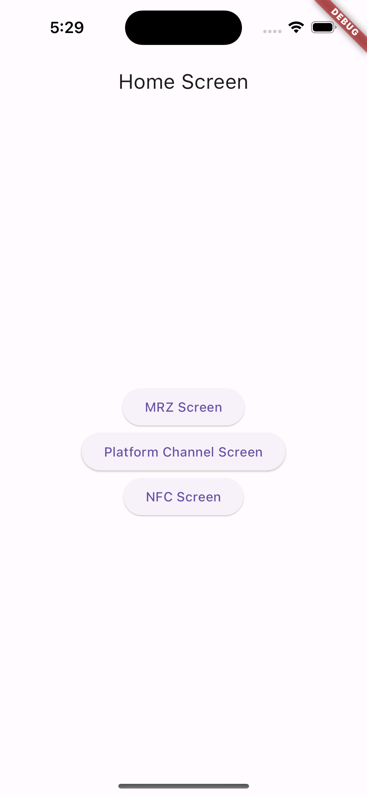

# mrz_nfc_poc

A new Flutter project to demonstrate NFC reading, MRZ scanning, and Platform Channel communication.

## Getting Started

To run this project, you need to have Flutter installed on your machine. If you don't have it installed, you can follow the instructions [here](https://flutter.dev/docs/get-started/install).

Once you have Flutter installed, you can clone this repository and run the following command in the project directory:

```bash
    flutter pub get
```

This will install all the dependencies required for the project. Once the dependencies are installed, you can run the project using the following command:

```bash
    flutter run
```

This will run the project on the connected device or emulator.

## Features

This project demonstrates the following features:

1. NFC Reading
2. MRZ Scanning
3. Platform Channel Communication

## Android Apks

You can find the Android apks for the project in the `apks` directory.

NOTE: To test on iOS, you need to run the project on Xcode.


## Screenshots

### Home Screen

